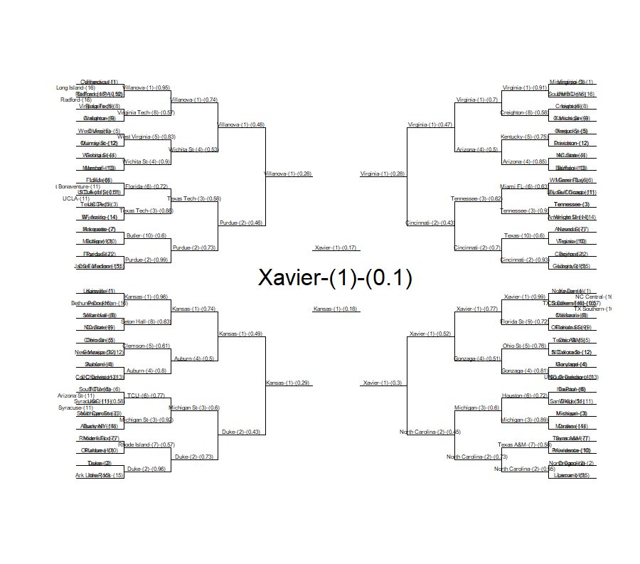

This simulation is intended to take the seed of a tournament and the pairwise probabilties of the teams playing, and simulate the tournament several thousand times to get the probability of each team becoming champion. 

Note that one of the inputs to this simulation is the pairwise probabilities of every team against every other team. This simulation is NOT intended to calculate those probabilities. It is only intended to use them to predict the likely winners of the tournament. 

# R Libraries

```{r message=FALSE, warning=FALSE, error=FALSE}
# List of packages to load:
packages <- c('readr', 'stringr', 'tidyverse', 'data.table','ggplot2')

# Check to see whether any packages aren't installed on the computer and install
new_packages <- packages[!(packages %in% installed.packages()[,"Package"])]
if(length(new_packages)) install.packages(new_packages)
  
# Load Neccessary Packages
sapply(packages, require, character.only = TRUE)
rm(new_packages)
```

# Method 1

Method 1 takes the final 64 teams and simulates who will win. It outputs the expected results of each round for each team.

## Importing Data

Data is from the Kaggle Competition directly, or from user submitted Kernels which have output the predicted pairwise probabilities.

```{r message=FALSE, warning=FALSE, error=FALSE}
## Load the user generated probabilities from a Kernel
# elo_probs <- read_csv(url("https://www.kaggleusercontent.com/kf/2593684/eyJhbGciOiJkaXIiLCJlbmMiOiJBMTI4Q0JDLUhTMjU2In0..jyN3-8es9ElgAMnGGr7ihQ.bG1HDZ36ahe4kJkt4GqX8-kCG8bm-OHWELhVzFalry3dQ56kSQtmoJcoYW4zPO18aJDFGQEUW9HqXwx14fvRHu79sy34Ek3vThY_wAsO7EdKsmAdOTlf_SpvU7Ahf5Lu1RcSpRy6Xb--MpzKIdFwkw.k2n5KyKDj2BI9T6HevzNJA/EloBenchmark.csv"))
pairwise_probs <- read_csv("DataFiles/EloBenchmark.csv")

# Tournament seed was downloaded from the kaggle competition site
#tourn_seed <- read_csv("DataFiles/NCAATourneySeeds.csv")
tourn_seed <- read_csv("2017_Final64.csv")

# Team ID to team names were downloaded from the kaggle competition site
team_names <- read_csv("DataFiles/Teams.csv")
```

## Reorganizing Data for Simulation

The data isn't provided in an easy to use lookup table, so in preparation for the simulation it is time to massage the data into the correct format. 

Also, each simulation run will be fore a single year. For this report the year **2017** will be chosen.

It might be useful to create a shiny app later, so functions are being used to parse the data and run the simulation instead of running the code without functions.

```{r message=FALSE, warning=FALSE, error=FALSE}
#---
# Select a Tournament Year
#---
tourn_year <- '2017'

#---
# Function that takes the output from the 2018 NCAA Kaggle Competition
# and generates a probability matrix for a specific year
#---
generate_prob.mat <- function(prob_table,year_in) {
  prob_table <- prob_table %>%
    separate(ID,c("year","team1","team2"))
  
  prob_year <- subset(prob_table,year == year_in)
  
  prob_year <- 
    tibble(team1 = prob_year$team1, 
           team2 = prob_year$team2,
           pred = prob_year$Pred) %>% 
    rbind(tibble(team1 = prob_year$team2, 
                 team2 = prob_year$team1,
                 pred = 1 - prob_year$Pred))
  
  # Each team combination should only appear once. 
  if(sum(duplicated(prob_year)) > 0) warning("Duplicate team pairs found")
  
  # Set up the left column to have each team to compare to
  prob_matrix_year <- tibble(team = unique(prob_year$team1))
  
  # Create a column for each team and join predictions
  for(team in unique(prob_year$team1)) {
    prob_matrix_year <- prob_matrix_year %>%
      full_join(select(subset(prob_year,team1 == team),-team1), 
                by = c("team" = "team2"))
    # The most recent column needs to be renamed
    colnames(prob_matrix_year)[length(colnames(prob_matrix_year))] <- team
  }
  
  return(prob_matrix_year)
}

#---
# Function that takes NCAATrouneySeeds and outputs in format needed
#---
parse_tourney_seeds <- function(in_seeds, year_in) {
  out_bracket <- in_seeds %>% 
    filter(Season == year_in) %>%
    select(TeamID)
  return(out_bracket)
}


#---
# Convert data
#---
bracket <- tourn_seed
bracket <- bracket %>%
  filter(TeamID != 1309) %>% # New Orleans isn't in final 64
  filter(TeamID != 1300) %>% # NC Central didnt' make it
  filter(TeamID != 1344) %>% # Providence didn't make it
  filter(TeamID != 1448) # Wake Forest didn't make it

prob.mat <- generate_prob.mat(pairwise_probs, tourn_year)
```

## Create Functions to Predict Tournament Outcome

The next step in the simulation is to create a function that will predict the outcome of the tournament based on the pairwise probabilities of each match and random chance.

The following function runs through the tournament one time. It uses a random number generator to generate value between 0 and 1. If that number is below the probability of team 1 winning, then team 1 wins and team 2 is removed from the list of teams, otherwise team 1 is removed from the list of teams. Then the code moves to team 3 and team 4, etc, etc.

Once the first round is calculated, the loop is started over until there is only 1 team left in bracket...the winner.

```{r message=FALSE, warning=FALSE, error=FALSE}
#---
# Begin predict_champion(matches.dt,prob.mat.dt) function.
# matches.dt is a file of team IDs organized such that
#   matches.dt[1] plays the first game against matches.dt[2]
#   and the winner of {1,2} plays against {3,4} and so on.
#
# Example bracket: matches <- data.table(teams = c('1112','1116','1124','1137'))
#---

predict_champion <- function(matches.dt, prob.mat.dt) {
  # Make a copy of the input of matches and coerce it to a data.table
  # Also, make each column a team name in the tournament for easy and
  # memory efficient deletion using the data.table methods
  dt <- as.data.table(transpose(matches.dt))
  names(dt) <- as.character(matches.dt[[1]])
  
  # Make a copy of prob.mat and coerce to data.table for consistency
  prob.mat.dt <- as.data.table(prob.mat.dt)
  
  
  # While there are 2 or more teams in dt, caculate the results of the next round
  while (length(dt)>1) {
    # For each pair in the table of matches, predict the winner of the pair
    # and then remove the loser from the table. Since we are deleting half
    # of the columns as we go, we increment n by 1 and only go through
    # length/2 columns
    for(n in 1:(length(dt)/2)) {
      # If random number is less than the probability in the probability matrix where 
      # team row contains name of team 2, column name contains name of team 2]
      if(runif(n=1,min=0,max=1) < prob.mat.dt[prob.mat.dt$team == dt[,2][[1]],get(as.character(dt[,1][[1]]))]){
        # Team 1 wins, so remove column for team 2
        colname <- names(dt)[n+1]
        dt[,(colname) := NULL]
      } else {
        # Team 2 Wins, so remove column for team 1
        colname <- names(dt)[n]
        dt[,(colname) := NULL]
      }
    }
    rm(n,colname) 
  }
  
  # Return the result
  return(dt[[1]])
}
```

## Simulate the Tournament Many Times

Getting one guess of who might be the winning team is pretty useless for predicting who will actually win the tournament. Next, it is necessary to run the simulation many times in order to get a distribution of teams that will win the championship, and their relative likelihood of winning compared to other teams.

To start, run the simulation 1000 times to review the output.

```{r message=FALSE, warning=FALSE, error=FALSE, results='hide'}
# Create a data.table to hold the number of times a team has won
tourn_results <- data.table(winner = character())
times_to_simulate <- 1000

# Make the results repeatable by setting the seed
set.seed(42)

start_time <- Sys.time()
pb <- txtProgressBar(min=0,max=times_to_simulate,style=3)

for(n in 1:times_to_simulate) {
  # tourn_results[TeamID == predict_champion(bracket,prob.mat),
  #               ':='(wins=wins+1)]
  tourn_results <- rbindlist(list(tourn_results,
                                  data.table(winner = predict_champion(bracket,prob.mat))
                                  )
                             )
  
  setTxtProgressBar(pb,n)
}

close(pb)
```

```{r message=FALSE, warning=FALSE, error=FALSE}
print(paste("Simulated",n,"rounds in",Sys.time()-start_time,attributes(Sys.time() - start_time)$units))
rm(n,start_time,pb)
```

## Reviewing the Results

The simulation returned a table that listed the winning team for each run of the simulation. This is difficult to graph. Instead it is easier to graph a cumulative sum or a percentage. 

```{r message=FALSE, warning=FALSE, error=FALSE}
tourn_results[,simulation := .I]

# Cumulatively sum the number of wins each team has
for(team in unique(tourn_results$winner)) {
  tourn_results[winner == team,cum_wins := .I]
}

# Calculate the percentage they have won from the start of the simulation
tourn_results[,cum_pct_wins := (cum_wins/.I)]
```

Graphing the data gives us a visual representation that can be used to estimate whether the model appears to have reached steady state or not.

```{r message=FALSE, warning=FALSE, error=FALSE, fig.width=9, fig.height=4}
ggplot(data = tourn_results) +
  geom_area(aes(x=simulation,y=cum_pct_wins,group=winner,color=winner,fill=winner),alpha=0.3)
```

It appears that the simulation has mostly flattened out after approximately 300 iterations. The next step is to calculate the final percentage of times a team won the entire tournament in 1000 simulations. 

```{r message=FALSE, warning=FALSE, error=FALSE}
pct_wins <- data.table(team = character(), pct_wins = numeric())
for(team in unique(tourn_results$winner)) {
  pct_wins <- rbindlist(list(pct_wins,
                             data.table(team = as.character(team),
                                        pct_wins = last(tourn_results[winner == team,]$cum_wins) / 
                                                          length(tourn_results$winner)
                                        )
                             )
                        )
}
pct_wins <- pct_wins %>% arrange(desc(pct_wins))
team_names <- as.data.table(team_names)

lookup_team_name <- function(TeamList) {
  out <- NULL
  for(team in TeamList) {
    out <- c(out,team_names[TeamID == team,]$TeamName)
  }
  return(out)
}

pct_wins %>% transmute(TeamID = team, TeamName = lookup_team_name(team), pct_wins = paste0(pct_wins*100,"%"))
```

## Grading the results of Method 1

Using the pairwise probabilities we downloaded did not result in a high probability for the team that won. 

The probabilities calculated for the final 4 teams were:

```{r}
pct_wins %>% 
  transmute(TeamID = team, TeamName = lookup_team_name(team), pct_wins = paste0(pct_wins*100,"%")) %>%
  filter(TeamName == "South Carolina" | TeamName == "Gonzaga" | TeamName == "Oregon" | TeamName == "North Carolina")
```

However, this is not necessarily a complete failure. The winning team ranked 5th and the runner up ranked 4th. 

So this method does show some promise in generating reasonable probabilities based on a very complex game full of many chances for upsets. 

## Method 1 next steps

It would be pretty quick to re-write this function to return the max position that each team made it to instead of just tracking the champion. That would allow the building of a bracket which would be much more usefull. 

# Method 2: Creating an actual Bracket using simulation

This method is a little more intense, but the goal is to create a bracket. This is being done for the year 2017 so that we can compare the results to see how well it predicts. 

```{r, fig.width=8.5, eval=FALSE}

library(data.table)


################## TEST PARAMETERS #####################################

    load(file =  "sub.Rdata",  envir = environment())
    # sub <- data.table(id = sub$ID, pred = sub$Pred)
    # save(sub, file = "sub.Rdata")
    # N = 100
    # year = 2017
    # upset_bias = 0
########################################################################
    

#   ____________________________________________________________________________
#   Clean Predictions Data   (use only if needs to be split sub.Rdata is already split)
    
    # sub$id <-  strsplit(sub$id, "_")
    # sub$season <-    as.integer(sapply(sub$id, "[", 1))
    # sub$team_1 <-  as.integer(sapply(sub$id, "[", 2))
    # sub$team_2 <- as.integer(sapply(sub$id, "[", 3))
    # sub <- sub[,-1]
#   ____________________________________________________________________________
#   Function to run simulation                                              ####
    simulation <- function (probs, N = 1000, year = 2017,  upset_bias = 0) 
    {
        
    load(file =  "all_slots.Rdata",  envir = environment())
    all_slots <- all_slots[women != 1]  
      
    probs <- probs[season == year, ]
    
    #Join slots to the predictions
    n1 <- nrow(probs)
    probs <- merge(probs, all_slots, by = c("season", "team_1", "team_2"))
    
#   Stopifnot(n1 == nrow(probs))
#   Determine seeds
    probs$seed_1_int <- as.integer(substr(probs$seed_1, 2, 3))
    probs$seed_2_int <- as.integer(substr(probs$seed_2, 2, 3))
#   Add some columns for tracking the simulation    
    probs$rand <- stats::runif(.N)
    probs$winner <- ifelse(probs$pred > probs$rand, "team_1", "team_2")
    probs$keep <- 1L
    
#   Add Upset Bias - upset bias will give close games to the underdog   
    if (upset_bias != 0) {
        
        probs$rand <- ifelse(probs$seed_1_int > probs$seed_2_int,  probs$rand - upset_bias, probs$rand - upset_bias)
       
    }
 
#   Run the simulation   
    sims_list <- lapply(1:N, function(x) {
        probs$rand <- stats::runif(.N)
        if (upset_bias != 0) {
            probs$rand <- ifelse(probs$seed_1_int > probs$seed_2_int,  probs$rand - upset_bias, probs$rand - upset_bias)
        }
        
        probs$winner <- ifelse(probs$pred > probs$rand, probs$team_1, probs$team_2)
        internal_sim(probs)
    })
#   Aggregate results   
    sims <- data.table::rbindlist(sims_list)
    data.table::setkeyv(sims, c("slot", "winner"))
    sims <- sims[, list(count = .N), by = c("slot", "winner")]
    sims[, `:=`(count, count + stats::runif(.N)/1e+12)]
    sims$count <- sims$count + (stats::runif(.N)/1e+12)
    
#       
    all_possible_slots_team_1 <- all_slots[season == year, list(slot, winner = team_1)]
    all_possible_slots_team_2 <- all_slots[season == year, list(slot, winner = team_2)]
    all_possible_slots <- unique(rbind(all_possible_slots_team_1, all_possible_slots_team_2))
    
    sims <- merge(all_possible_slots, sims, all.x = TRUE, by = c("slot", "winner"))
    
    sims$count[is.na(sims$count)] <- 0
    sims$prob <- sims$count/N
    sims <- sims[order(count, decreasing = TRUE)]
#   Add Year    
    sims$season <- year
    return(sims)
}


internal_sim <- function (probs) 
{
    all_rounds <- sort(unique(probs$round))
    
#   Evaluate the playin rounds    
    if (all_rounds[1] == 0) {
        r <- 0L
        round_team_1 <- probs[round == r, list(slot = next_slot, 
                                               team_1 = winner, keep_team_1 = 1L)]
        round_team_2 <- probs[round == r, list(slot = next_slot, 
                                               team_2 = winner, keep_team_2 = 1L)]
        probs <- merge(probs, round_team_1, by = c("slot", "team_1"), 
                       all.x = TRUE)
        probs <- merge(probs, round_team_2, by = c("slot", "team_2"), 
                       all.x = TRUE)
        probs[is.na(keep_team_1) & team_1_playedin == (r + 1L) & 
                  round == 1L, `:=`(keep, 0L)]
        probs[is.na(keep_team_2) & team_2_playedin == (r + 1L) & 
                  round == 1L, `:=`(keep, 0L)]
        probs <- probs[keep == 1L, ]
        probs[, `:=`(c("keep_team_1", "keep_team_2"), NULL)]
        all_rounds <- all_rounds[2:length(all_rounds)]
    }
#   Evaluate the regular rounds    
    for (r in 1:5) {
        round_team_1 <- probs[round == r, list(slot = next_slot, 
                                               team_1 = winner, keep_team_1 = 1L)]
        round_team_2 <- probs[round == r, list(slot = next_slot, 
                                               team_2 = winner, keep_team_2 = 1L)]
        probs <- merge(probs, round_team_1, by = c("slot", "team_1"), 
                       all.x = TRUE)
        probs <- merge(probs, round_team_2, by = c("slot", "team_2"), 
                       all.x = TRUE)
        probs[is.na(keep_team_1) & round == (r + 1L), `:=`(keep, 
                                                           0L)]
        probs[is.na(keep_team_2) & round == (r + 1L), `:=`(keep, 
                                                           0L)]
        probs <- probs[keep == 1L, ]
        probs[, `:=`(c("keep_team_1", "keep_team_2"), NULL)]
    }
    probs <- probs[, list(slot, round, team_1, team_2, winner)]
    data.table::setkeyv(probs, "slot")
    return(probs)
}


#   Extract a best bracket from a simulation result
#   Given the results of simTourney, this function pulls out a
#   single tournament result.

#   This function starts with the most likely winner, and then assumes
#   they won all prior games.  It then picks the most likely other team in the
#   championship game, and assumes that team won all prior games.  As such, it
#   works backwards to determine a single result from a simulation.

Create_Bracket <- function(sim){
  
  #Make a deep copy, so we don't update the original data
  dat <- data.table::copy(sim)
  dat[, slot_int := as.integer(slot)]
  
  #Walk backwards from the championship and choose a single tournament outcome

    dat[, prob := prob + stats::runif(.N)/1e12]
    dat[, res := as.integer(prob == max(prob)), by='slot']
    dat <- dat[res == 1,]
    dat[, res := NULL]

  
  return(dat)
}


#   Given an NCAA tournament bracket (a list of slots and who won the game)
#   this function will plot the bracket in a way that can be printed off.
   


Show_Bracket <- function(bracket, add_seed =TRUE , add_prob = TRUE){
    # add_seed =TRUE ; add_prob = TRUE
 
  load(file =  "seed_positions.Rdata",  envir = environment())
  load(file =  "slot_positions.Rdata",  envir = environment())
  load(file =  "NCAATourneySeeds.Rdata",  envir = environment())
  load(file =  "Teams.Rdata",  envir = environment())
 
   #copy to avoid updating data
  bracket <- data.table::copy(bracket)
  
  #Checks
  year <- sort(unique(bracket$season))
  stopifnot(length(year)==1)
  
  #Subset seeds current year
  tourney_seeds <- tourney_seeds[season == year,]
  
  #Add team names
  data.table::setnames(teams, 'teamid', 'team')
  data.table::setnames(bracket, 'winner', 'team')
  bracket_seeds <- merge(tourney_seeds, teams, by='team', all.x=TRUE)
  bracket <- merge(bracket, teams, by='team', all.x=TRUE)
  
  #Parse seeds
  if(add_seed){
    bracket_seeds[,seed_int := as.integer(substr(seed, 2, 3))]
    bracket <- merge(bracket, bracket_seeds[,list(team, seed_int)], by='team')
    
    bracket_seeds[,team_name := paste0(teamname, '-(', seed_int, ')')]
    bracket[,team_name := paste0(teamname, '-(', seed_int, ')')]
  }
  
  #Add probs
  if(add_prob){
    bracket[,team_name := paste0(team_name, '-(', round(prob, 2), ')')]
  }
  
  #Add printing positions
  bracket_seeds <- merge(bracket_seeds, seed_print_positions, by=c('seed'), all.x=TRUE)
  bracket <- merge(bracket, slot_print_positions, by=c('slot'), all.x=TRUE)
  
  #Setup plot
  x <- seq(0,220,(221/67))
  y <- 0:66
  graphics::plot(x,y,type="l", col.axis="white", col.lab="white", bty="n",axes=F, col="white")
  graphics::segments(0,c(seq(0,30,2),seq(34,64,2)),20,c(seq(0,30,2),seq(34,64,2)))
  graphics::segments(20,c(seq(0,28,4),seq(34,62,4)),20,c(seq(2,30,4),seq(36,64,4)))
  graphics::segments(20,c(seq(1,29,4),seq(35,63,4)),40,c(seq(1,29,4),seq(35,63,4)))
  graphics::segments(40,c(seq(1,25,8),seq(35,59,8)),40,c(seq(5,29,8),seq(39,63,8)))
  graphics::segments(40,c(3,11,19,27,37,45,53,61),60,c(3,11,19,27,37,45,53,61))
  graphics::segments(60,c(3,19,37,53),60,c(11,27,45,61))
  graphics::segments(60,c(7,23,41,57),80,c(7,23,41,57))
  graphics::segments(80,c(7,41),80,c(23,57))
  graphics::segments(80,c(15,49),100,c(15,49))
  graphics::segments(100,c(27,37),120,c(27,37))
  graphics::segments(200,c(seq(0,30,2),seq(34,64,2)),220,c(seq(0,30,2),seq(34,64,2)))
  graphics::segments(200,c(seq(0,28,4),seq(34,62,4)),200,c(seq(2,30,4),seq(36,64,4)))
  graphics::segments(180,c(seq(1,29,4),seq(35,63,4)),200,c(seq(1,29,4),seq(35,63,4)))
  graphics::segments(180,c(seq(1,25,8),seq(35,59,8)),180,c(seq(5,29,8),seq(39,63,8)))
  graphics::segments(160,c(3,11,19,27,37,45,53,61),180,c(3,11,19,27,37,45,53,61))
  graphics::segments(160,c(3,19,37,53),160,c(11,27,45,61))
  graphics::segments(140,c(7,23,41,57),160,c(7,23,41,57))
  graphics::segments(140,c(7,41),140,c(23,57))
  graphics::segments(120,c(15,49),140,c(15,49))
  
  #Print Winner
  winner <- bracket[slot == 'R6CH',]
  graphics::text(winner$x,winner$y,winner$team_name, cex=2)
  
  #Print Bracket
  bracket <- bracket[slot != 'R6CH',]
  graphics::text(bracket$x, bracket$y, bracket$team_name,cex=.5)
  
  #Print seeds
  graphics::text(bracket_seeds$x, bracket_seeds$y, bracket_seeds$team_name,cex=.5)
  
  #Return nothing
  return(invisible())
}


#   ____________________________________________________________________________
#   Run the simulation                                                      ####


sim <- simulation( sub, N = 1000, year = 2018,  upset_bias = 0 )
bracket <- Create_Bracket(sim)
Show_Bracket(bracket)
save(bracketImage,file="BracketImage.Rdata")
```




## Reviewing Results of Method 2

This method did generate a complete bracket with a few issues in the display of the first 64 teams. However, there is enough visibility here to review the results.

Of the teams that actually won the 2017 tournament, only 1 shows up in the top 8 teams, and only 2 show up in the top 16 teams. Moreover, the teams that were predicted by this simulation to make it to the top 4 only had 1 team actually make it to the top 8. 

This indicates that the method is not very good at making a bracket. This may be because of the pairwise probabilities entered, because of chance, or because of some other issue with the method.

Instead, it is recommended to improve Method 1 to output how likely each team is to make it to each round, and then let the user make their own bracket from that prediction.